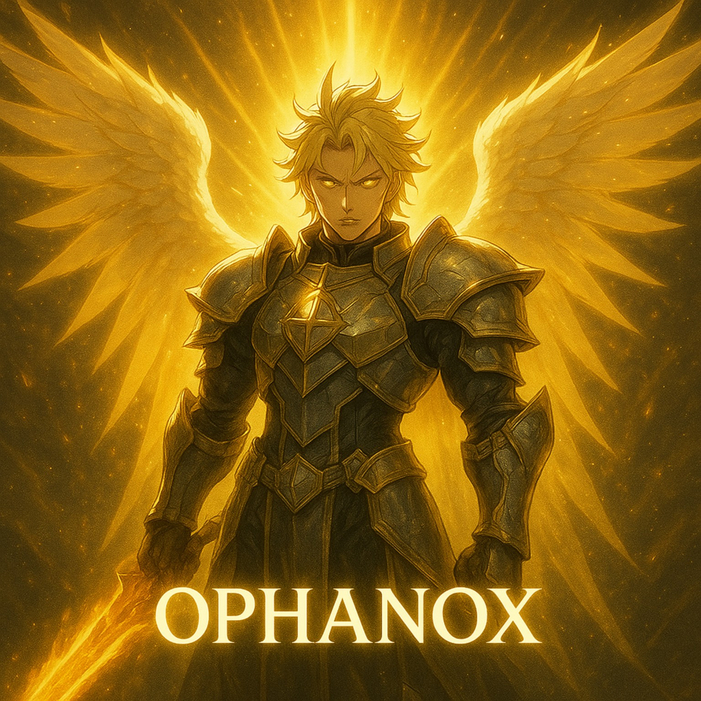

# OPHANOX WhatsApp Bot

<p align="center">
  
</p>

A WhatsApp Multi-Device Bot powered by [Baileys (WhiskeySockets)](https://github.com/WhiskeySockets/Baileys) and developed by Joseph Bonsu 🇬🇭.

---

## ⚡ Features
- Multi-device support
- Customizable prefix
- JSON-based local database
- Easy to deploy on cloud platforms

---

## 📦 Installation (Local)
```bash
# 1. Clone the repository
git clone https://github.com/YOUR_USERNAME/OPHANOX.git
cd OPHANOX

# 2. Install dependencies
npm install

# 3. Run the bot
npm start
```
---

## ⚙️ Environment Setup

```bash
Create a .env file in the root folder with the following variables:

OWNER_NUMBER=1234567890
BOTNAME=OPHANOX
PREFIX=.
SESSION_FOLDER=./session
```
---

## 🚀 Deployment (One-Click Hosting)

Easily deploy your bot on cloud platforms:

<p align="center">

1. <a href="https://bot-hosting.net">
    
  </a>
  
2. <a href="https://heroku.com/deploy">
    
  </a>
  
3. <a href="https://railway.app/new">
    
  </a>
  
4. <a href="https://app.koyeb.com/deploy?type=git&repository=https://github.com/OligoCodes/OPHANOX">
    
  </a>
  
5. <a href="https://render.com/deploy">
    
  </a>
  
6. <a href="https://replit.com/github/OligoCodes/OPHANOX">
    
  </a>
  
7. <a href="https://glitch.com/edit/#!/import/github/OligoCodes/OPHANOX">
    
  </a>
  
</p> 


---


## ⚡ Requirements

(α) [Node.js v16](https://nodejs.org/) or higher

(β) [Git](https://git-scm.com/)


---


## 📡 Stay Updated

Join our official channels for updates, credits, and announcements:

<p align="center">
  <a href="https://Whatsapp.com/channel/0029VbBVKfQI1rcsEUloFW18">
    
  </a>
  <a href="https://t.me/OligoTech">
    
  </a>
</p>


---


## 🤝 Contributing

Pull requests are welcome! If you’d like to suggest features or fix bugs, fork this repo and create a PR.


---


## 👤 Author

Created with ❤️ by Joseph K. Osei Bonsu (a.k.a OligoCodes)

---

## 🌟

<p align="center">
  <a href="https://github.com/OligoCodes/OPHANOX">
    
  </a>
</p>
